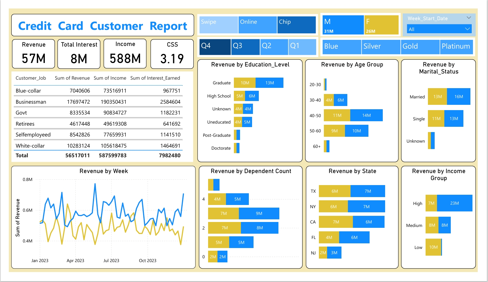
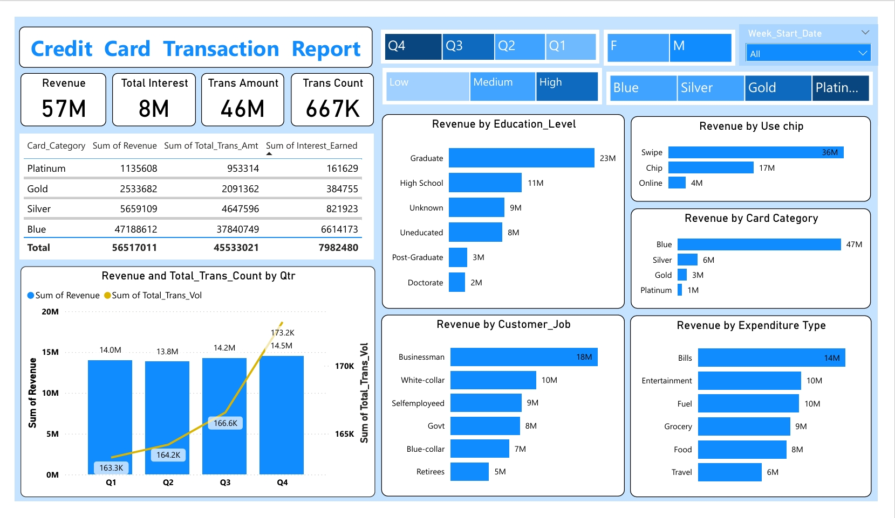

# Credit Card Financial Dashboard
Power BI Dashboard

## Project Overview
This Power BI project analyzes credit card customer behavior, transaction trends, and financial performance through interactive dashboards. __Data was extracted from SQL Server and transformed using Power Query__ to provide insights into customer demographics, spending patterns, revenue generation, and transaction activities for data-driven decision-making.

## Business Objective
To develop interactive dashboards that help stakeholders monitor credit card performance, customer behavior, transaction trends, and key financial KPIs.

## Tools & Technologies Used
- SQL Server
- Power BI
- Power Query
- DAX
- Data Modeling
- Data Visualization

## Dashboard 1: Customer Report

### Key Insights
- Total Revenue: 57M
- Total Interest Earned: 8M
- Male customers generated 31M revenue.
- Female customers generated 26M revenue.
- TX, NY, and CA contributed the highest revenue.
- High-income customers generated the largest share of revenue.

---

## Dashboard 2: Transaction Report

### Key Insights
- Total Transaction Amount: 46M
- Total Transaction Count: 667K
- Blue Card category generated the highest revenue.
- Swipe transactions contributed the majority of revenue.
- Q4 recorded the highest transaction volume and revenue.
- Bills, Entertainment, and Fuel were among the top spending categories.

---

## Business Value
The dashboards provide a comprehensive view of customer behavior and transaction performance, enabling businesses to identify revenue-driving segments, monitor KPIs, and make informed strategic decisions.

## Skills Demonstrated
- Power BI Dashboard Development
- SQL 
- DAX Calculations
- Power Query
- Data Modeling
- Data Visualization
- KPI Reporting
- Business Intelligence
- Data Analysis
